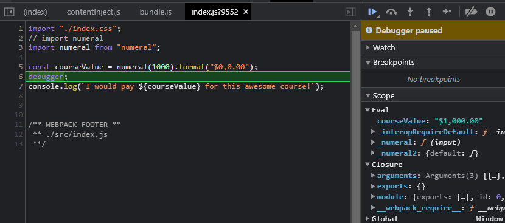

# Jascript Development Environment

This is a development environment for Jascript. It is a work in progress as taught in the Buidling a Jascript Development Environment course on [Building a Jascript Development Environment](https://www.pluralsight.com/courses/building-javascript-development-environment).

## Table of Contents

1. [Getting Started](#getting-started)
2. [Whats Included](#whats-included)
3. [NPM Scripts](#npm-scripts)
4. [Transpiling](#transpiling)
5. [Bundler](#bundle)
6. [Linting](#linting)

## Getting Started

### Why this project?

This project is a starting point for building a Jascript development environment.

Why you need a starter kit!

- Reduce decision fatigue
- Right things become easy
- Codifies lessons learned
- Provides a solid foundation
- Rapid feedback
- Automated checklist for new projects

### How to use this project

1. Clone this repo
2. `npm install`
3. `npm start`

## What's included

- [NPM](https://www.npmjs.com/) for package management
- [localtunnel](https://localtunnel.github.io/www/) for sharing your local dev server
- [Babel](https://babeljs.io/) for transpiling Jascript
- [ESLint](http://eslint.org/) for linting Jascript
- [Mocha](https://mochajs.org/) for testing
- [Chai](http://chaijs.com/) for assertions
- [webpack](https://webpack.github.io/) for bundling
- [Express](http://expressjs.com/) for a development web server
- [Open](https://www.npmjs.com/package/open) to open the web browser
- [npm-run-all](https://www.npmjs.com/package/npm-run-all) to run multiple npm scripts in parallel or sequential
- [chalk](https://www.npmjs.com/package/chalk) for console logging with colores
- [compression](https://www.npmjs.com/package/compression) for gzip compression
- [cross-env](https://www.npmjs.com/package/cross-env) for setting environment variables across platforms
- [jsdom](https://www.npmjs.com/package/jsdom) for testing in a headless browser

run `npm audit` to check for vulnerabilities in the packages and run `npm audit fix` to fix them. You can also run  `npm outdated` to check for outdated packages and run `npm update` to update them.

### localTunnel Commands

- `lt --port` - Port to forward to
- `--subdomain` - Subdomain to use and incluid with your temp domain

## NPM Scripts

- `start` - Runs the app in development mode
- `localtunnel` - Runs  local tunnel on port 3000
- `share` - runs all scripts at the same time

## Transpiling

Babel is a JavaScript compiler. It takes Jascript code, transforms it and returns vanilla Jascript in return. It is used to convert Jascript to ES6.

Babel is configured in the `.babelrc` file.

## Bundle

Webpack is a module bundler. It takes modules with dependencies and generates static assets representing those modules.

Webpack is configured in the `webpack.config.js` file.

### Source maps

Weback comes with source maps by addind `debugger` to our code it will add line breaks that will  provide us with
the original code. This is useful for debugging.

## Linting

ESLint is a tool for identifying and reporting on patterns found in Jascript code.
Currently ESlint is set up

- [ESLint Recomended](https://eslint.org/docs/latest/rules/)
- [eslint-watch](https://www.npmjs.com/package/eslint-watch)

ESLint is configured in the `.eslintrc.json` file.

## Testing

Mocha is a JavaScript test framework running on Node.js and in the browser, making asynchronous testing simple and fun. Mocha tests run serially, allowing for flexible and accurate reporting, while mapping uncaught exceptions to the correct test cases.

Mocha is configured in the `mocha.opts` file.

Chai is a BDD / TDD assertion library for Jascript that can be paired with any Jascript testing framework.

Chai is configured in the `testSetup.js` file.

| framework | assertion library | helpers |
|-----------|-------------------|---------|
| [Mocha](https://mochajs.org/) | [Chai](https://www.chaijs.com/) | [Jsdom](https://www.npmjs.com/package/jsdom) |

| Where to run tests | Where to place tests | When to run |
|--------------------|----------------------|-------------|
| Node               | Alongside            | Upon Save   |

## Continuous Integration

Travis CI is a hosted, distributed continuous integration service used to build and test software projects hosted at GitHub.

[Travis](https://www.travis-ci.com/)
